# LinkedIn-Job-Postings-Data-Analysis
**Title**: LinkedIn Job Posting Data Analysis 2023-2024<br><br>

## Introductory Information
<br>
**University of Prishtina**<br>
**Faculty of Computer and Software Engineering**<br> 
Master’s Program in **Computer and Software Engineering**                                            
Course: **Data preparation and visualization**


This project is developed for academic purposes as part of the course "Përgatitja dhe vizualizimi i të dhënave"  in the University of Prishtina, under the 'Inxhinieri Kompjuterike dhe Softuerike' program.<br>
This project analyzes LinkedIn job postings data from 2023-2024 to reveal trends in job availability and company hiring practices. This analysis aims to support job seekers on LinkedIn, especially those “open to work,” by helping them identify companies with the highest job postings, the types of jobs offered, and the best times of year to apply for positions in their field.

Additionally, companies can gauge interest in their job postings by analyzing view and application rates, offering insights into how their listings attract potential applicants. Given LinkedIn’s global presence as a job platform, visualizing this data helps job seekers understand how the job market demands align with their skills and qualifications.<br>
The dataset is publicly available on Kaggle, and you can access it [here](https://www.kaggle.com/datasets/arshkon/linkedin-job-postings).


 <strong>Notice</strong>: Due to size constraints, the postings.csv file is not included in this repository.

## Project Team Members (Group 15)
- **Edi Morina**
- **Alma Latifi**
- **Altin Musliu**


## Phase I Requirements - (15%)

The key objectives and requirements for this project include:

- **Data Preparation**: Preprocessing data to ensure quality and consistency for analysis.
  - **Data Collection and Quality**: Loading datasets, defining data types, and ensuring data quality checks.
  - **Integration and Aggregation**: Merging datasets to link job details with company and skill information.
  - **Sampling and Cleaning**: Identifying and handling missing values with appropriate strategies (e.g., imputation, filtering).
  
- **Dimensionality Reduction and Feature Selection**:
  - **PCA**: Applied Principal Component Analysis (PCA) for dimensionality reduction.
  - **Feature Selection and Creation**: Selected relevant attributes and created new features, such as `salary_category`.

- **Discretization and Binarization**:
  - **Discretization**: Grouped salary data into `Low`, `Medium`, and `High` categories.
  - **Binarization**: Applied one-hot encoding to categorical columns like `salary_category`.

- **Transformation**:
  - Applied scaling and transformation as needed for numerical features to improve consistency and readability in analysis.

### Key Steps

1. **Data Preprocessing**: Defined data types, handled missing values, and integrated datasets.
2. **PCA for Dimensionality Reduction**: Reduced high-dimensional numerical data to principal components.
3. **Analysis**: Insights into salary levels.
4. **Seasonal Classification**: A function get_season() categorizes job postings based on their posting and expiry dates, which allows insights into when job postings peak by season.

### File Descriptions

- `postings.csv`: Raw LinkedIn job postings data.
- `PreprocessingData.ipynb`: Jupyter Notebook with data processing and analysis.
- `Preprocessed_job_postings`: Pre-processed LinkedIn job posting data.
- `README.md`: Project documentation (this file).

### Visualizations for Phase 1

- **Skill Merging**:  
  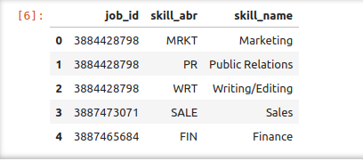  
  

- **Aggregation**:  
  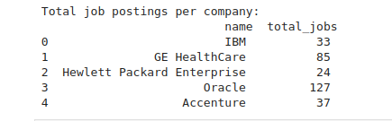  
  

- **Sampling**:  
  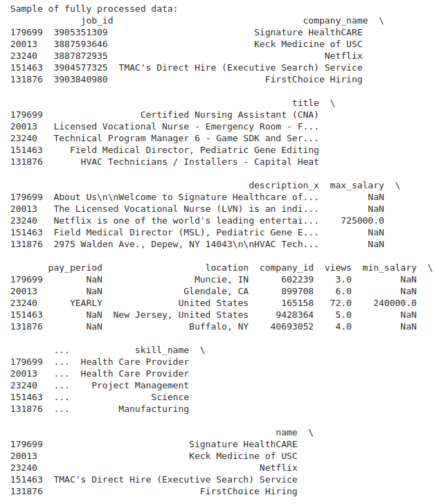  
  

- **Discretization**:  
  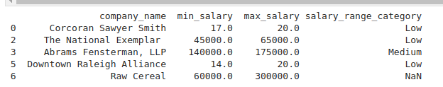  
  

- **Binarization**:  
  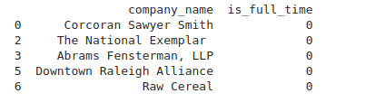  
  

- **PCA**:  
  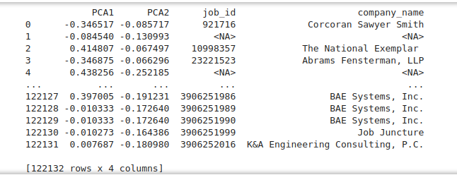

### Summary

In Phase I, we focused on data preparation by ensuring the quality and consistency of the dataset. This included loading the data, defining types, and performing quality checks. We merged job, company, and skill datasets, handled missing values, and applied dimensionality reduction using PCA. Additionally, salary data was discretized, categorical features were binarized, and numerical features were scaled for improved analysis. These steps have prepared the data for more advanced analysis in the next phase.


## Phase II Requirements - (15%)

The second phase of the project focuses on detecting outliers and performing exploratory data analysis (EDA). This phase includes the following steps:

### **Outlier Detection and Handling**
- **Identification of Outliers**: Detect and analyze outliers in the dataset using statistical methods.
- **Exclusion of Incorrect Discoveries**: Remove or correct data entries that are found to be incorrect or irrelevant to the analysis.
  - Example methods: IQR (Interquartile Range), Z-Score, visual inspection through boxplots.

### **Exploratory Data Analysis (EDA)**
- **Descriptive Statistics**: Summarize key statistics such as mean, median, and standard deviation to understand data distribution.
- **Multivariate Analysis**: Perform analysis on multiple variables to find relationships and patterns.
  - Example: Correlation matrix, pairplots, or scatter plots to investigate the relationships between salary, location, and experience level.

### **Visualizations for Phase 2**

- **PCA Scatter Plot**:  
  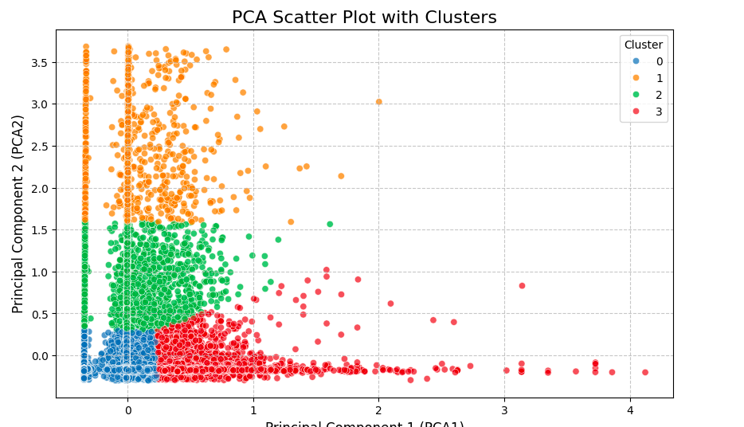
  
  
- **Distribution Of Job Posting**:  
  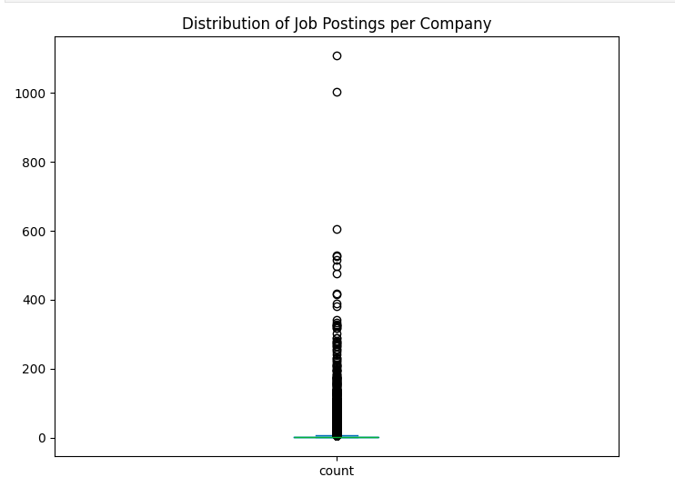  


- **Distribution After Z-score**:  
  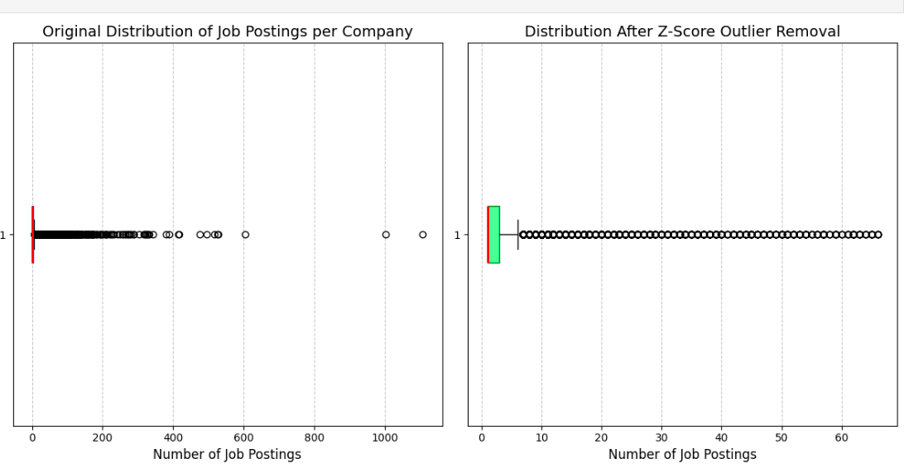

  
- **Top Companies with Most Job Posting After IQR Implementation**:  
  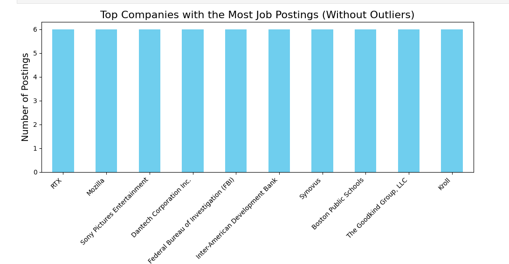


- **Removing Outliers And Normalizing The Pay Period**:  
  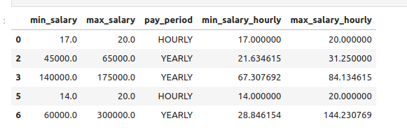


- **Distribution of Hourly Salaries**:  
  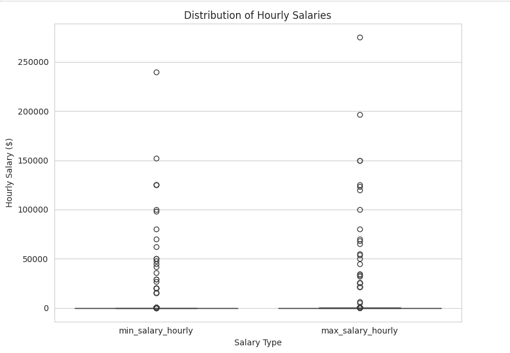


- **Distribution of Hourly Salaries After Z-score Implementation**:  
  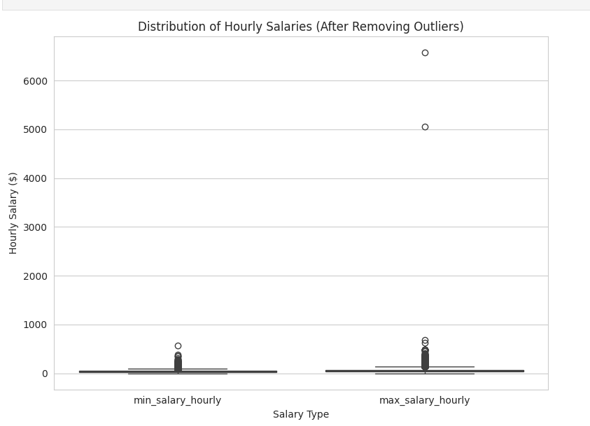


- **Distribution of Hourly Salaries Second Step After IQR Implementation**:  
  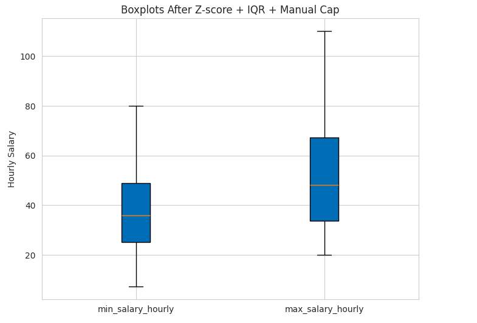

- **Variability Of Applies and Views**:  
  

- **Variability Of Applies and Views After Using Z-score anf Handling Skewness**:  
  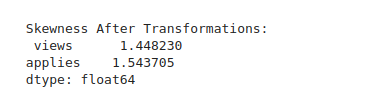
  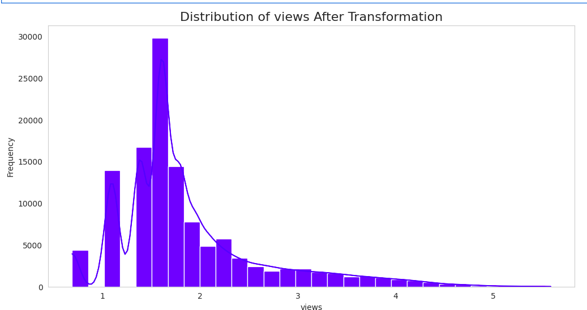 
  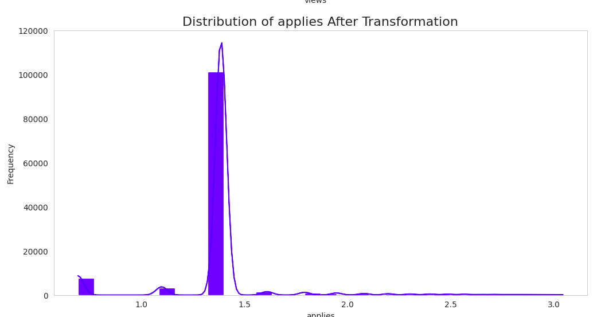


- **Variability Of Applies and Views With Mean, Median Mode**:
  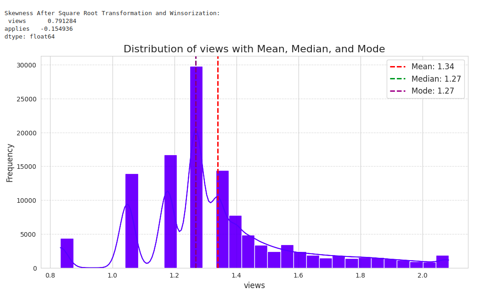 
  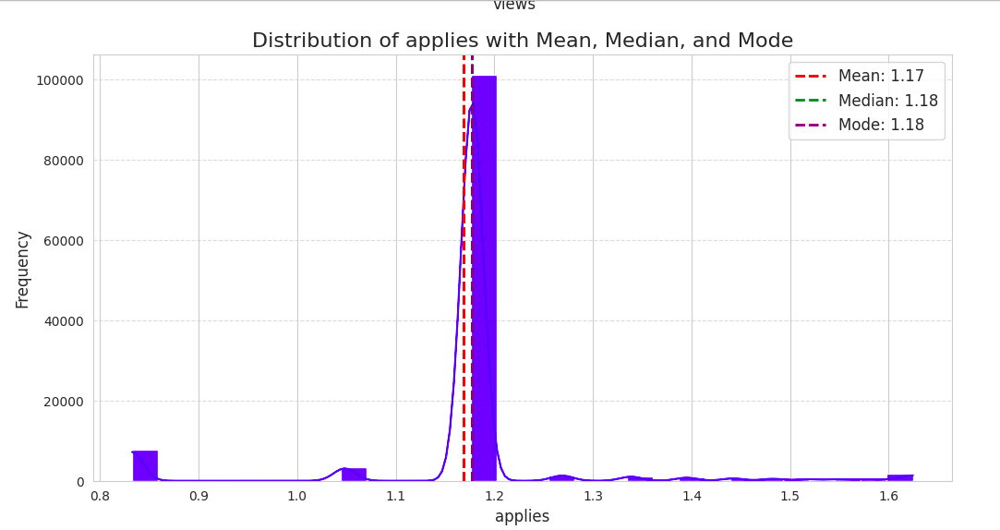

### Summary

By the end of Phase II, we have cleaned the dataset, reduced dimensionality, and provided insights from the exploratory analysis and outlier handling. These steps are essential for preparing the data for the next phase, where advanced modeling techniques will be applied.


### Prerequisites

- Python 3.x
- Libraries: `pandas`, `numpy`, `scikit-learn`, `matplotlib`, `sklearn`, `seaborn`, `scipy`

### Installation

```bash
pip install pandas numpy scikit-learn matplotlib, sklearn, seaborn, scipy